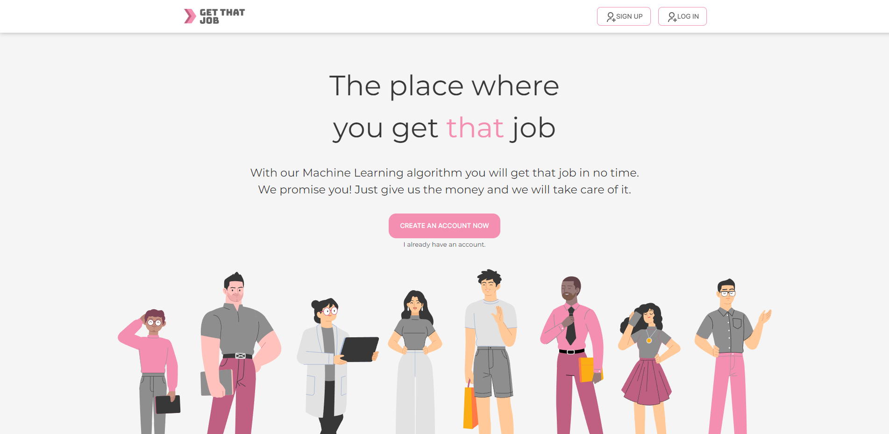

  

<h1 align="center">Get That Job!</h1>

> **Current version is v.1.0.0**

Get That Job is a job-searching platform for anyone who looking for employment or looking to recruit someone. We have a variety of features to support all those and help your online recruitment and hiring process go more easily!

**Killer Features**:

- A recruiter could be able to create job postings and manage jobs status.
- A professional could be able to view job postings and, apply jobs, and check jobs status.
- A professional could be able filter and following jobs.
- Have validation system for checking an emails, password, and more
- (Beta) Friendly for many device. Included mobiles, tablets, laptops, and desktops! (full release in v.2.0.0)
- (Beta) Support Thai and English langauge. (full release in v.2.0.0)

**Stack we Used**:

  
  
  
  
  
  

  
  
  
  
  
  
  
  
  
  
  

## Deployed Website Link

[www.getthatjob.com](https://github.com/techupth/get-that-job)

## Preview Images

## Developers

<h3> 1. 🐳Akira Chenyavanij (Nut)
  
    
  
</h3>
<li> Authentication: Login (Full Stack) </li>
<li> Professional-Page: Find that job (Front-End) </li>
<li> Professional-Page: Your Applications (Front-End) </li>
<li> Professional-Page: Following (Full Stack) </li>
<li> Recruiter-Page: Create New Job (Front-End) </li>
<li> Make all pages responsive </li>
<li> Other utilities and shared components </li>
<li> Vadilations </li>
<li> Performance Optimization </li>
 
<h3> 2. 🦀Arisara Vichitpataya (Cream)
  
    
  
</h3>
<li> Authentication: Register-Professional (Full Stack) </li>
<li> Professional-Page: Find that job (Full Stack) </li>
<li> Professional-Page: Your Applications (Back-End) </li>
<li> Professional-Page: Following (Back-End) </li>
<li> Recruiter-Page: Create New Job (Back-End) </li>
<li> Recruiter-Page: Job Positions (Back-End) </li>
<li> Vadilations </li>
<li> Other utilities and shared components </li>
<li> Unit test with Cypress </li>
 
<h3> 3. 🦑Nutthaporn Fueangsukon (Nikki)
  
    
  
</h3>
<li> Get That Job Homepage </li>
<li> Recruiter-Page: Update Recruiter Profile (Full Stack) </li>
<li> Recruiter-Page: Job Positions (Front-End) </li>
 
<h3> 4. 🐡Pisinee Sathianpakorn (Aom)
  
    
  
</h3>
<li> Authentication: Register-Recruiter (Full Stack) </li>
<li> Professional-Page: Update Professional Profile (Full Stack) </li>
<li> Recruiter-Page: Job Positions (Front-End) </li>

## Special Thanks! (Credit)

<li>Teletubbies Photo: https://us.teletubbies.com/about-teletubbies/</li>
